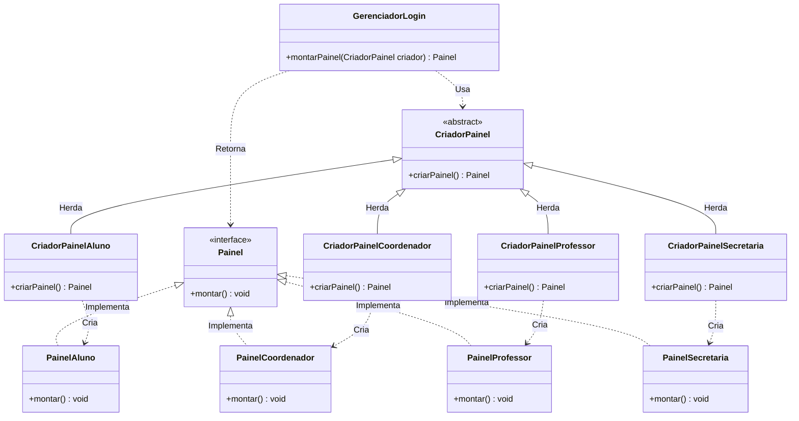

```mermaid

classDiagram
    direction TB

    class Painel {
        <<interface>>
        +montar() void
    }

     class PainelAluno {
        +montar() void
    }

    class PainelCoordenador {
        +montar() void
    }

    class PainelProfessor {
        +montar() void
    }

    class PainelSecretaria {
        +montar() void
    }

    class CriadorPainel {
        <<abstract>>
        +criarPainel() Painel
    }

     class CriadorPainelAluno {
        +criarPainel() Painel
    }

    class CriadorPainelCoordenador {
        +criarPainel() Painel
    }

    class CriadorPainelProfessor {
        +criarPainel() Painel
    }

    class CriadorPainelSecretaria {
        +criarPainel() Painel
    }

    class GerenciadorLogin {
        +montarPainel(CriadorPainel criador) Painel
    }

    Painel <|.. PainelAluno: Implementa
    Painel <|.. PainelCoordenador: Implementa
    Painel <|.. PainelProfessor: Implementa
    Painel <|.. PainelSecretaria: Implementa

    CriadorPainel <|-- CriadorPainelAluno: Herda
    CriadorPainel <|-- CriadorPainelCoordenador: Herda
    CriadorPainel <|-- CriadorPainelProfessor: Herda
    CriadorPainel <|-- CriadorPainelSecretaria: Herda

    CriadorPainelAluno ..> PainelAluno: Cria
    CriadorPainelCoordenador ..> PainelCoordenador: Cria
    CriadorPainelProfessor ..> PainelProfessor: Cria
    CriadorPainelSecretaria ..> PainelSecretaria: Cria

    GerenciadorLogin ..> CriadorPainel: Usa
    GerenciadorLogin ..> Painel: Retorna
```